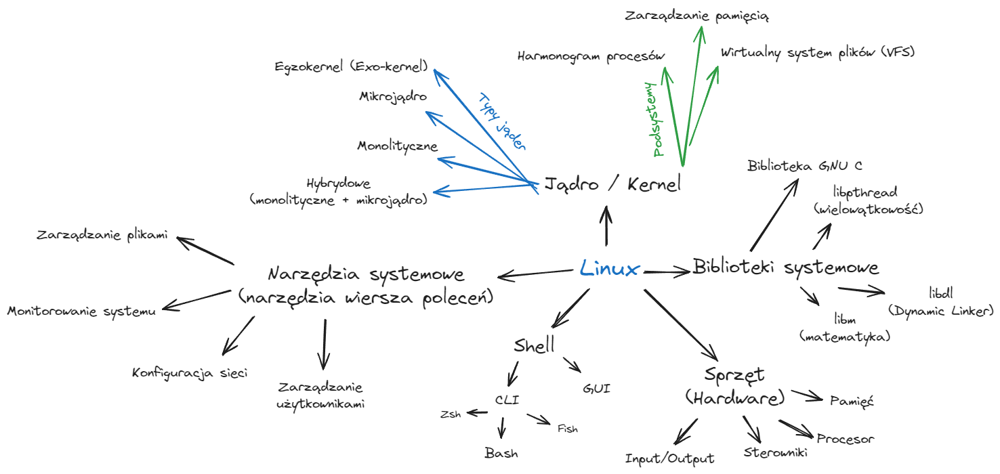

# Wstęp
- **Linux - definicja**:
    - Linux to **system operacyjny typu open source**, oparty na systemie UNIX.
    - Głównym składnikiem systemu Linux jest **jądro Linux**.
    - Linux jest nie tylko systemem operacyjnym dla komputerów osobistych, ale także szeroko stosowany w serwerach, systemach wbudowanych, superkomputerach, a nawet w urządzeniach IoT.
    - Działa na licencji GPL, czyli jego kod źródłowy pozostaje otwarty.
- **Cel opracowania**:
    - Linux został stworzony w celu zapewnienia **niedrogiej lub bezpłatnej** usługi systemu operacyjnego, głównie dla użytkowników systemów osobistych.
- **Kluczowe elementy Linux**:
    - **Jądro Linux** – podstawowy komponent, zarządzający sprzętem i zasobami systemowymi.
    - **System X-window** – odpowiada za graficzny interfejs użytkownika (GUI).
    - **Edytor Emacs** – edytor tekstu, popularny w środowisku UNIX/Linux.
    - **IP/TCP** – protokoły komunikacyjne używane w sieciach komputerowych.

## Dystrybucje
- **Czym jest dystrybucja Linuksa?**
    - Dystrybucja Linuksa to **zestaw oprogramowania**, który opiera się na **jądrze Linuksa**.
    - Umożliwia **wykonywanie operacji na różnych systemach**, takich jak systemy osobiste i systemy wbudowane.
	- Różne dystrybucje są tworzone z myślą o różnych zastosowaniach, np. **Debian** jest znany ze swojej stabilności, **Arch Linux** z elastyczności, a **Kali Linux** z przeznaczenia do testów penetracyjnych.
- **Popularne dystrybucje Linuksa**:

    - **MX Linux**
    - **Manjaro**
    - **Linux Mint**
    - **elementary OS**
    - **Ubuntu**
    - **Debian**
    - **Solus**
    - **Fedora**
    - **openSUSE**
    - **Deepin**
# Składniki Linuxa

## Jądro systemu Linux:
- Jądro to **kluczowy komponent** systemu operacyjnego, który kontroluje działanie sprzętu oraz innych procesów systemowych.
- **Zarządza zasobami sprzętowymi** (takimi jak pamięć, procesor), dostarczając każdemu procesowi **niezbędne zasoby wirtualne**.
- Kolejkuje procesy do wykonania w celu **zapobiegania konfliktom** między nimi.
### Typy jąder systemu operacyjnego Linux:

#### Jądro monolityczne:
- Wszystkie procesy są wykonywane jednocześnie **w obrębie jądra**.
- Wszystkie procesy **współdzielą te same zasoby pamięci**.

Wyobraź sobie kucharza, który robi **wszystko**: gotuje, zmywa, obsługuje klientów. W jądrach monolitycznych wszystkie zadania systemu (np. obsługa sprzętu, pamięci) są zintegrowane w jednym dużym bloku. Działa to szybko, ale jeśli coś się zepsuje, cały system może przestać działać.
#### Mikrojądro:
- **Oddziela przestrzeń adresową** usług użytkownika od przestrzeni usług jądra.
- Usługi użytkownika znajdują się w **przestrzeni adresowej użytkownika**, a usługi jądra w **przestrzeni jądra**.

Tu mamy wielu kucharzy, każdy w osobnym pokoju, odpowiedzialny za swoje zadania. Mikrojądra wykonują tylko najważniejsze funkcje, a inne zadania, jak obsługa sprzętu, są "na zewnątrz" jądra. Dzięki temu awaria jednego elementu nie psuje całego systemu, ale całość może działać wolniej.
#### Egzokernel (Exo-kernel):
- Odpowiada za **zarządzanie zasobami sprzętowymi** na poziomie aplikacji.
- **Abstrakcja wysokiego poziomu** pozwala aplikacjom na bezpośredni dostęp do zasobów sprzętowych.

To jak restauracja bez kucharza – goście sami gotują. W egzokernelu programy mają bezpośredni dostęp do zasobów komputera bez pośrednictwa jądra, co może być szybkie, ale wymaga lepszej kontroli ze strony programów.
#### Jądro hybrydowe:
- Połączenie **monolitycznego jądra** (szybkość i prostota) oraz **mikrojądra** (modułowość i stabilność).
- Charakteryzuje się **lepszą modułowością i stabilnością** przy zachowaniu **wysokiej wydajności**.

Mieszanka obu podejść: główny kucharz robi kluczowe rzeczy, ale inne zadania są oddzielone. Łączy zalety monolitu i mikrojądra – szybkie działanie i stabilność.
#### Podsumowanie:

- **Monolityczne jądro**: Jeden wielki kucharz robi wszystko (Linux).
- **Mikrojądro**: Każdy kucharz ma swoją specjalność i pracuje osobno (Minix).
- **Egzokernel**: Goście sami gotują, kucharz tylko nadzoruje (bardziej nowoczesne podejście).
- **Jądro hybrydowe**: Mieszanka monolitu i mikrojądra, trochę centralnego zarządzania, trochę oddzielenia zadań (Windows).

## Główne podsystemy jądra
### Harmonogram procesów:
- **Zarządza przydziałem czasu procesora** dla wszystkich uruchomionych procesów.
- Zapewnia **sprawiedliwy podział czasu przetwarzania**, aby każdy proces mógł działać efektywnie i unikać konfliktów.

Wyobraź sobie, że jądro to nauczyciel w klasie, który dba o to, żeby każde dziecko (proces) miało tyle samo czasu na zabawę (używanie procesora). 

### Jednostka zarządzania pamięcią:
- Odpowiada za **przydział zasobów pamięci** dla procesów działających równolegle.
- Gwarantuje, że każdy proces otrzymuje odpowiednią ilość pamięci do poprawnego działania.

To jak bibliotekarz, który przydziela miejsce na półkach (pamięć) dla każdej książki (procesu). 

### Wirtualny system plików (VFS):
- **Umożliwia dostęp do danych** niezależnie od systemu plików czy nośnika fizycznego.
- Zapewnia wspólny **interfejs do obsługi różnych systemów plików**, co umożliwia pracę z różnorodnymi nośnikami i strukturami plików.

Wyobraź sobie, że masz różne rodzaje szafek (nośniki danych) i kluczy (systemy plików), ale wirtualny system plików to taki uniwersalny klucz, który pasuje do wszystkich szafek. Dzięki niemu, programy mogą korzystać z danych bez martwienia się, jaki dokładnie system plików jest używany.

Te podsystemy są kluczowe dla prawidłowego funkcjonowania jądra i całego systemu operacyjnego.

## Biblioteka systemowa
- Biblioteki systemowe to **zestaw wstępnie zdefiniowanych funkcji**, które umożliwiają aplikacjom i narzędziom systemowym dostęp do funkcji jądra.
- Stanowią **podstawę** do tworzenia oprogramowania, udostępniając narzędzia niezbędne do komunikacji z systemem operacyjnym.

To jak pudełko z narzędziami, które pozwala programom szybciej i sprawniej wykonywać zadania, bez konieczności budowania wszystkiego od zera.

### Najważniejsze biblioteki systemowe w Linuksie:
- **Biblioteka GNU C (glibc)**:
    - Podstawowa biblioteka języka C, **obsługująca interfejs i wykonywanie programów w C**.
    - Zawiera wiele **wbudowanych funkcji** do codziennych operacji programistycznych.

To jak instrukcja obsługi dla programów napisanych w języku C. Zawiera wszystkie podstawowe narzędzia, które programy C potrzebują, żeby działać i wykonywać operacje.

- **libpthread (wątki POSIX)**:
      - Umożliwia **obsługę wielowątkowości** w systemie Linux.
      - Pozwala użytkownikom na **tworzenie i zarządzanie** wieloma wątkami jednocześnie.

Wyobraź sobie, że masz grupę osób pracujących nad różnymi zadaniami jednocześnie. Ta biblioteka pozwala programom w systemie Linux tworzyć i zarządzać wieloma "osobami" (czyli wątkami), które pracują równocześnie.
 
- **libdl (Dynamic Linker)**:
       - Odpowiada za **dynamiczne ładowanie i łączenie** plików w trakcie wykonywania programu.

To jak specjalny robot, który w trakcie działania programu może dołączyć nowe narzędzia do pracy. Odpowiada za "ładowanie" dodatkowych części oprogramowania, kiedy są potrzebne.

- **libm (biblioteka matematyczna)**:
       - Udostępnia **funkcje matematyczne**, takie jak operacje trygonometryczne, logarytmiczne itp.

Zawiera wszystkie potrzebne funkcje do wykonywania skomplikowanych operacji matematycznych, jak kalkulator dla programów.

**Inne ważne biblioteki systemowe**:
    - **librt**: Obsługuje funkcje **czasu rzeczywistego**.
    - **libcrypt**: Oferuje **funkcje kryptograficzne**.
    - **libnss**: Biblioteka odpowiedzialna za **przełączanie usług nazw**.
    - **libstdc++**: Standardowa biblioteka dla języka **C++**.

Biblioteki systemowe są niezbędne dla poprawnego działania aplikacji, gdyż zapewniają zestaw funkcji do interakcji z jądrem i innymi elementami systemu.

## Shell - powłoka
- Powłoka to **interfejs jądra**, który **ukrywa wewnętrzne procesy** wykonywania funkcji jądra przed użytkownikiem.
- Umożliwia użytkownikom **wydawanie poleceń**, a następnie za pomocą funkcji jądra wykonanie odpowiednich zadań.

Powłoka to coś w rodzaju tłumacza między użytkownikiem a jądrem systemu. Pozwala użytkownikowi wydawać polecenia, a jądro wykonuje zadania, nie pokazując, co dzieje się "w środku". Użytkownik wpisuje komendę, a powłoka zajmuje się jej realizacją.

### Rodzaje powłok:
1. **Powłoka wiersza poleceń (CLI)**:
    - Umożliwia **wykonywanie poleceń tekstowych**, które użytkownik wprowadza.
    - Program zwany **terminalem** wykonuje te polecenia i wyświetla wyniki **w tym samym terminalu**.
    - Przykłady powłok wiersza poleceń: **Bash, Zsh, Fish**.

To jak rozmowa z komputerem poprzez pisanie. Użytkownik wpisuje polecenia w wierszu poleceń (np. w terminalu), a komputer wykonuje zadania i wyświetla wyniki w tym samym oknie.

2. **Graficzny interfejs użytkownika (GUI)**:
	- Pozwala użytkownikowi na wykonywanie poleceń **za pomocą graficznych elementów**, takich jak okna, przyciski czy ikony.
    - Wynik działania poleceń wyświetlany jest w **graficznym oknie**.
    - Przykłady środowisk GUI: **GNOME, KDE, XFCE**.

Zamiast pisać, użytkownik klika przyciski, ikony i wybiera opcje. Komputer wykonuje zadania i wyświetla wyniki w oknach graficznych, jak np. w systemie Windows czy macOS.

Powłoka jest kluczowym narzędziem, które umożliwia interakcję z systemem Linux, zarówno w formie tekstowej (CLI), jak i graficznej (GUI).
## Warstwa sprzętowa
- Jest to **najniższa warstwa** w architekturze systemu Linux, odpowiedzialna za zarządzanie wszystkimi komponentami sprzętowymi.
- Odpowiada za **sterowanie sprzętem** poprzez sterowniki urządzeń oraz **zarządzanie zasobami**, takimi jak pamięć, procesor, oraz operacje wejścia/wyjścia.

Zarządza wszystkimi fizycznymi elementami komputera, takimi jak procesor, pamięć, dyski czy urządzenia wejścia/wyjścia. Upraszcza skomplikowaną komunikację z urządzeniami, zapewniając, że wszystko działa sprawnie i współpracuje z oprogramowaniem.

W skrócie, warstwa sprzętowa to "mózg" odpowiedzialny za kontrolowanie rzeczywistego sprzętu komputera.

### Główne funkcje warstwy sprzętowej:
- **Sterowniki urządzeń**: Umożliwiają komunikację między sprzętem a oprogramowaniem, zapewniając obsługę różnych urządzeń.
- **Funkcje jądra**: Warstwa sprzętowa współpracuje z jądrem w celu zarządzania zasobami sprzętowymi.
- **Zarządzanie pamięcią**: Odpowiada za **alokację i dealokację** pamięci dla procesów.
- **Kontrola procesora**: **Zarządza wykorzystaniem procesora** przez różne procesy w systemie.
- **Operacje wejścia/wyjścia (I/O)**: Umożliwia przesyłanie danych między urządzeniami (np. dyskiem twardym, klawiaturą) a systemem operacyjnym.
### Uogólnienie warstwy sprzętowej
- Warstwa sprzętowa **ukrywa złożoność sprzętu**, dostarczając **uogólniony interfejs** dla wyższego poziomu oprogramowania, co pozwala na sprawne działanie wszystkich komponentów.

Warstwa sprzętowa jest kluczowa dla prawidłowego funkcjonowania systemu, ponieważ umożliwia efektywne zarządzanie sprzętem przez system operacyjny.
## Narzędzia systemowe
Narzędzia systemowe to programy uruchamiane w wierszu poleceń, które pomagają użytkownikowi zarządzać systemem. Umożliwiają wykonywanie różnych zadań, takich jak zarządzanie plikami, monitorowanie działania systemu, konfiguracja sieci czy zarządzanie użytkownikami. Ułatwiają codzienną administrację systemem i jego optymalne działanie.

W skrócie, narzędzia systemowe to zestaw narzędzi dla użytkownika do zarządzania systemem operacyjnym.
### Czym są narzędzia systemowe?
- Narzędzia systemowe to **narzędzia wiersza poleceń**, które umożliwiają wykonywanie różnych zadań administracyjnych i zarządzania systemem.
- Pozwalają użytkownikowi na **usprawnienie zarządzania systemem** poprzez szybki dostęp do funkcji administracyjnych.
### Zadania wykonywane przez narzędzia systemowe:
- **Zarządzanie plikami**: np. kopiowanie, przenoszenie, usuwanie plików.
- **Monitorowanie systemu**: śledzenie wydajności systemu, zasobów CPU, pamięci, oraz przestrzeni dyskowej.
- **Konfiguracja sieci**: zarządzanie połączeniami sieciowymi, adresami IP, i konfiguracją routera.
- **Zarządzanie użytkownikami**: dodawanie i usuwanie użytkowników, nadawanie uprawnień, oraz zarządzanie grupami użytkowników.
### Przykłady narzędzi systemowych:
- **`ls`, `cp`, `mv`** – zarządzanie plikami.
- **`top`, `htop`** – monitorowanie zasobów systemu.
- **`ifconfig`, `ip`** – konfiguracja sieci.
- **`useradd`, `usermod`** – zarządzanie użytkownikami.

Narzędzia systemowe są niezbędne dla administratorów i użytkowników do efektywnego zarządzania systemem Linux oraz wykonywania codziennych zadań administracyjnych.
## Wnioski
- **Jądro (Kernel)** to **najpotężniejszy i najbardziej wszechstronny składnik** systemu operacyjnego Linux. Odpowiada za kontrolę funkcji całego systemu, zapewniając szeroki zakres możliwości.
- Kernel umożliwia użytkownikowi **łatwy i interaktywny dostęp** do funkcji systemu poprzez **powłokę (muszlę)**.
- **Sprzęt** jest kluczowym elementem dla prawidłowego działania systemu operacyjnego, ponieważ zapewnia zasoby, które są zarządzane przez jądro i inne komponenty.
- **Pozostałe składniki** systemu Linux, takie jak narzędzia systemowe, biblioteki oraz warstwa sprzętowa, przyczyniają się do tego, że system Linux jest:
    - **Łatwy w użyciu**
    - **Szybki**
    - **Stabilny**
    - **Niezawodny**

Linux jako system operacyjny oferuje użytkownikom duże możliwości i stabilność, dzięki synergii pomiędzy jego komponentami.
